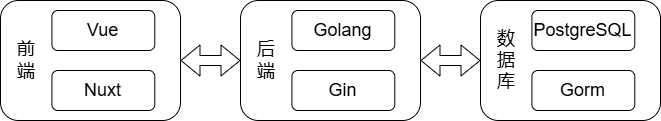

# 关于视频流推荐系统的技术设计

## 概述

本技术设计文档旨在详细描述一个基于Golang、Gin、PostgreSQL、GORM和Vue+Nuxt.js的视频流推荐系统的设计和实现。系统将包括用户管理、视频管理、推荐算法以及前端展示等功能模块。

## 技术栈

1. 后端：
   - 编程语言：Golang
   - Web框架：Gin
   - 数据库：PostgreSQL
   - ORM：GORM
2. 前端：
   - 框架：Vue.js
   - 服务端渲染：Nuxt.js

## 系统架构

系统采用前后端分离的架构，前端通过HTTP API与后端进行数据交互。后端负责业务逻辑处理和数据存储，前端负责用户交互和界面展示。



## 功能模块

### 用户管理

#### 功能描述

- 用户注册

- 用户登录

- 用户信息管理

#### 数据库设计

   表名：User

   ```go
   type User struct {
    gorm.Model
    ID       string `json:"id" gorm:"primaryKey"`
    Username string `json:"username" gorm:"unique"`
    Password string `json:"-" gorm:"not null"`
   }
   ```

#### API设计

- 注册：`POST /api/user/register`
- 登录：`POST /api/user/login`
- 获取用户信息：`GET /api/user`
- 修改密码：`PUT /api/user/password`
- 修改用户名：`PUT /api/user/username`
- 删除用户：`DELETE /api/user`

### 推荐系统

#### 功能描述

- 根据视频点赞数量推荐视频

#### 推荐算法

- 基于点赞数量的推荐算法

#### 数据库设计

   表名：Movie

   ```go
   type Movie struct {
    gorm.Model
    Title  string `json:"title"`
    Author string `json:"author"`
    Like   uint   `json:"like" gorm:"default:0"`
    Path   string `json:"path"`
   }
   ```

#### API设计

- 视频推荐：`GET /api/movie/movies%2Fe3b4ab48-5e14-4041-9d70-eeee9087a4c0.mp4`

3. ### 视频管理

#### 功能描述

- 上传视频
- 获取视频列表
- 获取视频详情

#### 数据库设计

   表名：History

   ```go
   type History struct {
    CreatedAt *time.Time `json:"time"`
    MovieID   uint       `json:"movie_id"`
    UserID    string     `json:"user_id"`
   }
   ```

   表名：History

   ```go
   type Like struct {
    ID      int    `json:"id" gorm:"primaryKey"`
    MovieID uint   `json:"movie_id"`
    UserID  string `json:"user_id"`
   }
   ```

#### API设计

- 视频上传：`POST /api/movie`
- 视频删除：`DELETE /api/movie`
- 已上传视频信息的获取：`GET /api/movie/author`
- 指定Id的视频的获取：`GET /api/movie`
- 视频列表的获取：`GET /api/movie/list`

## 项目结构

#### 后端实现——Golang和Gin框架

```shell
API-Big-Work
├─ .gitignore
├─ API设计与实现_大作业_精简版.pdf
├─ config
│  ├─ config.go
│  └─ url_test.go
├─ go.mod
├─ go.sum
├─ main.go
├─ models
│  ├─ history.go
│  ├─ init.go
│  ├─ like.go
│  ├─ movie.go
│  └─ user.go
├─ README.md
├─ server
│  ├─ middlewares
│  │  ├─ jwt.go
│  │  ├─ logger.go
│  │  ├─ rate_limit.go
│  │  └─ request_counter.go
│  ├─ router.go
│  └─ service
│     ├─ movie_service.go
│     ├─ service.go
│     └─ user_service.go
└─ utils
   ├─ jwt.go
   ├─ jwt_test.go
   ├─ password.go
   ├─ password_test.go
   └─ response.go
```

#### 前端实现——Vue.js和Nuxt.js框架

```shell
tiktok-web
├─ .gitignore
├─ app.vue
├─ assets
│  ├─ css
│  │  └─ main.css
│  └─ images
│     ├─ mobile-case.png
│     ├─ tiktok-logo-small.png
│     ├─ tiktok-logo-white.png
│     └─ tiktok-logo.png
├─ bun.lockb
├─ components
│  ├─ AuthOverlay.vue
│  ├─ EditProfileOverlay.vue
│  ├─ Login.vue
│  ├─ MenuItem.vue
│  ├─ MenuItemFollow.vue
│  ├─ PostMain.vue
│  ├─ PostUser.vue
│  ├─ Register.vue
│  ├─ SideNavMain.vue
│  ├─ TextInput.vue
│  ├─ TopNav.vue
│  └─ UploadError.vue
├─ layouts
│  ├─ MainLayout.vue
│  └─ UploadLayout.vue
├─ nuxt.config.ts
├─ package-lock.json
├─ package.json
├─ pages
│  ├─ index.vue
│  ├─ post
│  │  └─ [id].vue
│  ├─ profile
│  │  └─ [id].vue
│  └─ upload
│     └─ index.vue
├─ plugins
│  ├─ axios.js
│  └─ stores.js
├─ pnpm-lock.yaml
├─ public
│  └─ favicon.ico
├─ README.md
├─ stores
│  ├─ general.js
│  ├─ profile.js
│  └─ user.js
├─ tailwind.config.js
└─ tsconfig.json
```

## 总结

本视频流推荐系统通过Golang和Gin框架构建高效的后端服务，结合PostgreSQL和GORM实现数据存储与操作。前端采用Vue.js和Nuxt.js实现用户友好的界面和交互。系统功能模块包括用户管理、视频管理和推荐系统，各模块间通过API进行数据交互，实现完整的推荐系统功能。
